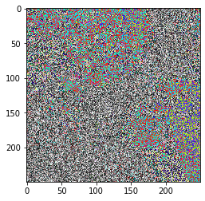

# Image Encryption using Chaos Maps
This is a project in cryptography that involves implementing image encryption using various chaos maps and comparing their merits based on key sensitivity, adjacent pixel autocorrelation and intensity histograms. The chaos maps implemented were - Arnold cat maps, Henon maps and Logistic chaos maps.
 

<b> What are chaos maps? </b>
 
Chaotic systems are a simple sub-type of nonlinear dynamical systems. They contain a few interacting parts which follow simple rules, but these systems are characterized by a very sensitive dependence on their **initial conditions**. Despite their deterministic simplicity, over time these systems can display and divergent behavior.

 

**Why Chaos Maps for encryption?**
 
Traditional encrypting mechanisms AES and RSA exhibit some drawbacks
and weakness when it comes to encryption of digital images 
  and high computing

*   Large computational time for large images
*   High computing power for large images
Consequently, there might be better techniques for image encryption.

 

A few chaos based algorithms provide a good combination of speed, high security complexity, low computational overheads 
Moreover, **certain** chaos-based and other dynamical systems based algorithms have many important properties such as 

*   sensitive dependence on initial parameters
*   pseudorandom properties
*   ergodicity
*   non periodicity

[Link to notebook](https://colab.research.google.com/drive/1A0tgOrrFwQxmbvBEY9lqzLEFVv7Iit6T) with detailed documentation hosted on Google Colab.
 
Alternatively it is in ChaosEncryption.ipynb
 
Write-up for the report is in ChaosMaps_WriteUp.pdf .
## Images
### Original Image

### Encrypted Images

#### Image after Arnold Cat Encryption

#### Image after Henon Map Encryption

#### Image after Logistic Map Encryption

## Intensity Histogram

The ciphertext image histogram analysis is one of the most straight-forward methods ofillustrating the image encryption quality. A good image encryption method tends to encrypt a plaintext image to a random incomprehensible form. Thus a good image encyption technique generates a cipher image that has a uniformly distributed intensity histogram.

## Adjacent Pixel Autocorrelation

Since images exhibit high information redundancy, it is desirable to have an encryption algorithm that breaks this redundancy. Thus as a metric of encryption performance we find the correlation between adjacent pixels in a direction (Horizontal, Vertical or Diagonal). We have considered the Horizontal direction. 

1024 random pixels are picked up from the image and its correlation between it's rightmost neighbour is found and plotted. For a good algorithm, the correlation plot should appear random with no discernable pattern.

 

## Key Sensitivity
An ideal image encryption algorithm should be sensitive with respect to thesecret key i.e a small change in the key should produce a completely differentencrypted image.To test the key sensitivity the we encrypt the plain image with the threealgorithms. We then try decrypting them with a slightly changed key.
### Arnold Cat
#### Original Image

#### Encrypted with key = 20

#### Decrypted with key = 19

### Henon Map
#### Original Image

#### Encrypted with key = (0.1, 0.1)

#### Decrypted with key = (0.1, 0.101)

### Logistic Map
#### Original Image

#### Encrypted with key = "supersecretke"

#### Decrypted with key = "supersecretkd"

